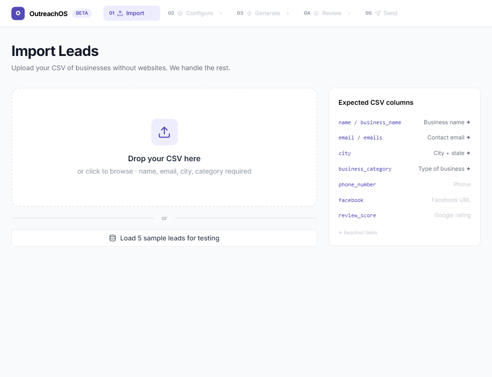

<div align="center">

# OutreachOS

**AI-powered cold email automation — from lead list to sent in minutes**

[](https://fastapi.tiangolo.com)
[](https://react.dev)
[](#ai-providers)
[](https://tailwindcss.com)
[](https://docker.com)
[](LICENSE)

*Built by [Arcen Studio](https://arcenstudio.com) · Mumbai, India*

</div>

---

## What is OutreachOS?

OutreachOS turns a raw CSV of business leads into personalized cold emails — researched, written, reviewed, and delivered — without any copy-pasting or manual work.

Drop in a list of businesses. AI researches each one, writes a tailored email with a competitor gap angle and a clear CTA. You review and approve. One click sends everything via Gmail with human-like delays built in.

**Zero generic emails. Zero manual effort. Full control.**

---

## Screenshots

### 01 — Import Leads


### 02 — Configure Campaign


### 03 — AI Draft Engine


### 04 — Review & Edit


### 05 — Send


---

## The 5-Step Flow

```
📥 Import  →  ⚙️ Configure  →  🤖 Generate  →  👁 Review  →  📨 Send
```

| Step | What happens |
|------|-------------|
| **01 Import** | Drag-drop your CSV, preview leads, flag missing emails |
| **02 Configure** | Set pitch, tone, CTA, sender details, and AI providers |
| **03 Generate** | AI researches each business and writes a personalized cold email |
| **04 Review** | Read AI research, edit subject/body per lead, approve or skip, redraft individually |
| **05 Send** | Drip-send in batches with 25–90s human-like delays, daily cap, full send log |

---

## Key Features

**AI Email Writing**
- Parallel multi-provider drafting — Gemini, Groq, Cerebras, Mistral, OpenRouter, Claude
- Automatic fallback if any provider hits rate limits
- Strict anti-slop prompt — no "I hope this finds you well", no corporate speak
- Structured 4-paragraph format: hook → competitor gap → what we do → CTA

**Batch Sending**
- Split approved leads into labelled batches (A, B, C…)
- 25–90 second random delay between emails — mimics human sending
- 10-minute cooldown enforced between batches
- Hard daily cap (400 emails/account) to protect deliverability
- **Send All** button — runs all batches sequentially, fully autonomous, no human needed after first click
- Real-time progress per batch with sent/error counts

**Review Workflow**
- Per-lead email editor with live subject + body fields
- AI Research panel shows competitor context behind each email
- Approve, Skip, or Redraft individually
- Approve All Drafted in one click

**Infrastructure**
- FastAPI async backend — polls and sends never block each other
- SQLite with safe schema migrations on startup
- Docker Compose + Caddy for production deploy
- SMTP credentials stay in-browser only — never stored in DB

---

## AI Providers

OutreachOS supports 6 providers, all configurable from the UI — no code changes needed.

| Provider | Free Tier | Notes |
|----------|-----------|-------|
| **Gemini** | ✅ Yes | `gemini-2.0-flash-lite` recommended |
| **Groq** | ✅ Yes | `llama-3.1-8b-instant` — fastest |
| **Cerebras** | ✅ Yes | `llama3.1-8b` — very fast inference |
| **Mistral** | ✅ Yes | `mistral-small-latest` |
| **OpenRouter** | ✅ Free models | Routes to many providers |
| **Claude** | Paid | `claude-haiku-4-5` — highest quality |

Add API keys in **Configure → AI Configuration**. Keys are stored in `sessionStorage` only.

---

## Tech Stack

| Layer | Technology |
|-------|-----------|
| Frontend | React 18 + Tailwind CSS + shadcn/ui + Lucide Icons |
| Backend | FastAPI (Python 3.11) + SQLAlchemy ORM |
| AI | Multi-provider: Gemini, Groq, Cerebras, Mistral, OpenRouter, Claude |
| Database | SQLite (persistent Docker volume) |
| Email | smtplib STARTTLS — Gmail App Password |
| Deploy | Docker Compose + Caddy reverse proxy |

---

## Quick Start

### Prerequisites

- [Docker Desktop](https://www.docker.com/products/docker-desktop/)
- At least one AI API key (Gemini free tier is enough to start)
- Gmail App Password for sending

### Run locally

```bash
# 1. Clone
git clone https://github.com/mehetab-01/outreachos.git
cd outreachos

# 2. Set up environment
cp .env.example .env
# Edit .env — add at least one AI key

# 3. Start
docker compose up --build
```

Open **http://localhost:3000** — first build takes ~3 minutes, restarts are instant.

### Without Docker (dev mode)

```bash
# Backend
cd backend
pip install -r requirements.txt
cp ../.env.example .env   # fill in your keys
uvicorn main:app --reload --port 8000

# Frontend (separate terminal)
cd frontend
npm install
npm start
```

---

## Environment Variables

Copy `.env.example` to `.env` and fill in the keys you have. You only need **one** AI provider to start.

```env
# AI Providers — add whichever you have
GEMINI_API_KEY=AIza...
GROQ_API_KEY=gsk_...
CEREBRAS_API_KEY=csk-...
MISTRAL_API_KEY=...
OPENROUTER_API_KEY=sk-or-v1-...
ANTHROPIC_API_KEY=sk-ant-...
```

---

## CSV Format

| Column | Also recognised as | Required |
|--------|--------------------|----------|
| `name` | `business_name` | ✅ |
| `email` | `emails`, `email_address` | ✅ |
| `city` | `location` | ✅ |
| `business_category` | `category`, `type` | ✅ |
| `phone_number` | `phone`, `contact` | Optional |
| `facebook` | `facebook_url`, `fb` | Optional |
| `review_score` | `rating`, `stars` | Optional |

**Example:**
```csv
name,email,city,business_category,phone_number,review_score
Rustic Scruff,hello@rusticscruff.com,Coal City,pet_groomer,+1-815-518-5153,4.9
```

---

## Project Structure

```
OutreachOS/
├── backend/
│   ├── main.py          # FastAPI — all API endpoints
│   ├── ai.py            # Multi-provider AI — parallel dispatcher, rate limiting, fallback
│   ├── email_sender.py  # SMTP sender with STARTTLS
│   ├── models.py        # SQLAlchemy — Campaign, Lead, Draft, SendBatch, SendLog
│   ├── schemas.py       # Pydantic request/response schemas
│   ├── database.py      # SQLite engine + session factory
│   ├── requirements.txt
│   └── Dockerfile
├── frontend/
│   ├── src/
│   │   ├── screens/     # ImportScreen, ConfigureScreen, GenerateScreen, ReviewScreen, SendScreen
│   │   ├── components/  # TopNav, StatusBadge, shadcn/ui components
│   │   ├── context/     # AppContext — global state
│   │   └── lib/         # api.js (axios), utils.js
│   ├── Dockerfile
│   └── nginx.conf
├── docs/
│   └── screenshots/
├── docker-compose.yml
├── Caddyfile
├── .env.example
└── README.md
```

---

## Troubleshooting

**"No AI provider configured"**
```
→ Add at least one API key in Configure → AI Configuration
→ Or set GEMINI_API_KEY / GROQ_API_KEY in backend/.env
```

**Gmail authentication failed**
```
→ Use an App Password, not your real Gmail password
→ Generate at: myaccount.google.com/apppasswords
→ Enable 2-Step Verification first
```

**Emails going to spam**
```
→ 25–90s delays between emails are already built in
→ Don't exceed 400 emails/day from a fresh Gmail account
→ Warm up the sending address before large campaigns
→ Avoid link-heavy or image-heavy emails
```

**Drafts stuck on "Drafting…"**
```
→ Check backend logs: docker compose logs backend --tail=50
→ Usually a rate limit — the dispatcher auto-retries and falls back to next provider
→ Click Redraft on any stuck lead to retry manually
```

---

## Roadmap

- [ ] Open/click tracking — pixel + link wrapper
- [ ] Reply detection — IMAP polling
- [ ] Follow-up sequences — Day 3, Day 7 automated
- [ ] CRM board — Contacted → Replied → Call Booked → Won
- [ ] Domain warm-up advisor
- [ ] LinkedIn outreach module

---

<div align="center">

**Built by [Arcen Studio](https://arcenstudio.com) — Mumbai, India**

*We build custom websites, full-stack apps, and AI-powered products.*

</div>
